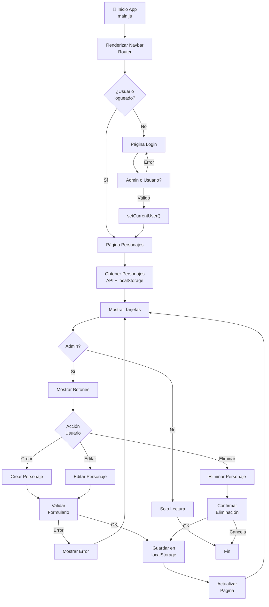

<!-- ========================================
ACTIVIDAD SPA - RICK AND MORTY API
Single Page Application con CRUD
======================================== -->

# Actividad Completada: SPA Rick and Morty

## ✅ Estado: Funcional

La aplicación está completamente funcional y cumple con todos los requerimientos del README.

---

## 📁 Estructura del Proyecto

```
spa-main/
├── src/
│   ├── main.js                    # Punto de entrada, inicializa navbar y router
│   ├── style.css                  # Estilos Tailwind personalizados
│   ├── pages/
│   │   ├── login.js               # TASK: Página de Login
│   │   ├── characters.js          # TASK: Página de Personajes (CRUD)
│   │   ├── episodes.js            # TASK: Página de Episodios
│   │   ├── locations.js           # TASK: Página de Ubicaciones
│   │   ├── dashboard.js           # (Legacy)
│   │   └── admin.js               # (Legacy)
│   ├── router/
│   │   └── router.js              # TASK: Sistema de enrutamiento SPA
│   ├── services/
│   │   ├── api.js                 # TASK: Servicios de API
│   │   └── state.js               # TASK: Manejo de estado local
│   └── utils/
│       └── helpers.js             # TASK: Funciones auxiliares
├── package.json
├── index.html
└── vite.config.js
```

---

## 🎯 Requerimientos Implementados

### ✅ PARTE 1: Nuevas Páginas SPA

#### Requerimiento 1 - Página de Episodios
- ✓ Muestra nombre del episodio
- ✓ Muestra fecha de emisión
- ✓ Muestra cantidad de personajes participantes
- ✓ Paginación integrada
- ✓ Navegación sin recargar página

#### Requerimiento 2 - Página de Ubicaciones
- ✓ Muestra nombre de la ubicación
- ✓ Muestra tipo
- ✓ Muestra dimensión
- ✓ Muestra cantidad de residentes
- ✓ Paginación integrada
- ✓ Navegación sin recargar página

#### Requerimiento 3 - Navegación SPA
- ✓ Rutas configuradas (/characters, /episodes, /locations)
- ✓ Renderizado dinámico sin recargar página
- ✓ Navegación activa indicada visualmente
- ✓ Control de vistas con historial del navegador

---

### ✅ PARTE 2: CRUD de Personajes

#### Requerimiento 4 - Eliminar Personaje
- ✓ Eliminación visual inmediata
- ✓ No recarga la página
- ✓ DOM actualizado dinámicamente
- ✓ Confirmación antes de eliminar
- ✓ Diferencia entre personajes API y custom

#### Requerimiento 5 - Crear Personaje Ficticio
- ✓ Formulario SPA para crear personajes
- ✓ Campos: Nombre, Especie, Género, Estado, URL Imagen
- ✓ Renderizado dinámico sin recargar
- ✓ Coexiste con personajes de la API
- ✓ Persistencia en localStorage
- ✓ Visibilidad inmediata

#### Requerimiento 6 - Editar Personaje
- ✓ Modal de edición implementado
- ✓ Puede editar: Nombre, Especie, Estado
- ✓ Integridad de datos API preservada
- ✓ Sobrescritura visual mediante estado local
- ✓ Sincronización renderizado-estado

#### Requerimiento 7 - Manejo de Errores
- ✓ Imágenes rotas manejadas con placeholder
- ✓ Respuestas vacías controladas
- ✓ Errores API capturados
- ✓ Validación de formularios incompletos
- ✓ Mensajes de error al usuario

#### Requerimiento 8 - Confirmaciones y Feedback
- ✓ Notificaciones de éxito (green)
- ✓ Notificaciones de error (red)
- ✓ Confirmación antes de eliminar
- ✓ Feedback en tiempo real

---

## 🛠️ Tecnologías Utilizadas

- **Vite** - Bundler y servidor de desarrollo
- **Tailwind CSS** - Estilos y diseño responsivo
- **Axios** - Cliente HTTP para consumir API
- **Vanilla JavaScript** - Lógica de la aplicación
- **Rick and Morty API** - https://rickandmortyapi.com/

---

## 📝 Decisiones Arquitectónicas

### 1. Manejo de Estado
```
PERSONAJES = [Personajes API] + [Personajes Locales] + [Ediciones Locales]
```

- Personajes API: Se obtienen de la API
- Personajes Locales: Se crean y guardan en localStorage
- Ediciones Locales: Se sobrescriben en localStorage sin afectar API

### 2. Persistencia
- `localStorage`: 
  - `created_characters`: Personajes creados localmente
  - `edited_characters`: Ediciones a personajes API

### 3. Diferenciación de Personajes
- Custom: `id = "custom_${timestamp}"`
- API: `id = número`
- Función helper: `isCustomCharacter(id)`

### 4. Sincronización
- **API** ← Lectura de datos originales
- **localStorage** ← Persistencia local
- **DOM** ← Renderizado mergeado (API + localStorage)
- **Estado de UI** ← Actualización en tiempo real

---

## 🚀 Cómo Ejecutar

```bash
# 1. Instalar dependencias
npm install

# 2. Iniciar servidor de desarrollo
npm run dev

# 3. Abrir en navegador
http://localhost:5173/

# 4. Compilar para producción
npm run build

# 5. Ver build de producción
npm run preview
```

---

## 🔍 Funcionalidades Demostradas

### Página de Login
- Interfaz de bienvenida
- Descripción de funcionalidades
- Botón para acceder a la app

### Página de Personajes
- Lista de personajes paginada (20 por página)
- Botón "+ Crear Personaje" abre modal
- Modal con validación de formulario
- Botones Editar y Eliminar por personaje
- Modal de edición de personajes existentes
- Persistencia en localStorage
- Notificaciones de éxito/error

### Página de Episodios
- Lista de episodios paginada
- Información completa: nombre, episodio, fecha, personajes
- Paginación interactiva

### Página de Ubicaciones
- Lista de ubicaciones paginada
- Información completa: nombre, tipo, dimensión, residentes
- Paginación interactiva

### Navegación
- Barra de navegación persistente
- Links sin recargar página
- Indicador visual de ruta activa
- Soporte de navegación atrás/adelante

---

## 📈 Diagrama de Flujo del Programa



## 📊 Estructura de Datos

### Personaje (API)
```json
{
  "id": 1,
  "name": "Rick Sanchez",
  "status": "Alive",
  "species": "Human",
  "gender": "Male",
  "image": "url..."
}
```

### Personaje (Local)
```json
{
  "id": "custom_1234567890",
  "name": "Juan Pérez",
  "species": "Human",
  "gender": "Male",
  "status": "Alive",
  "image": "url...",
  "isCustom": true
}
```

### Episodio
```json
{
  "id": 1,
  "name": "Pilot",
  "episode": "S01E01",
  "air_date": "December 2, 2013",
  "characters": ["url1", "url2", ...]
}
```

### Ubicación
```json
{
  "id": 1,
  "name": "Earth (C-137)",
  "type": "Planet",
  "dimension": "Dimension C-137",
  "residents": ["url1", "url2", ...]
}
```

---

## 🎓 Conceptos Implementados

- ✅ Manipulación DOM dinámico
- ✅ Arquitectura SPA
- ✅ Modularidad y separación de responsabilidades
- ✅ Routing sin recargar página
- ✅ Asincronismo (async/await)
- ✅ Renderizado dinámico
- ✅ Manejo de estado local
- ✅ Persistencia con localStorage
- ✅ Event listeners y delegación
- ✅ Desacoplamiento de código
- ✅ Reutilización de funciones
- ✅ Debugging con console.log

---

## 📱 Responsividad

La aplicación es completamente responsiva usando Tailwind CSS:
- Mobile: 1 columna
- Tablet: 2 columnas
- Desktop: 3-4 columnas

---

## 🔐 Validaciones Implementadas

1. **Formulario de Creación**
   - Nombre requerido
   - Especie requerida
   - Género seleccionado
   - Estado seleccionado
   - URL de imagen válida

2. **Imágenes**
   - Validación de URLs
   - Fallback a placeholder si falla

3. **Confirmaciones**
   - Antes de eliminar personaje
   - Feedback visual de operaciones

---

## 🐛 Manejo de Errores

- Try/catch en llamadas API
- Mensajes de error descriptivos
- Fallbacks para datos faltantes
- Validación de entrada de usuario

---

## 📦 Instalaciones Realizadas

```bash
✅ vite@^8.0.12
✅ @tailwindcss/vite@^4.3.0
✅ tailwindcss@^4.3.0
✅ axios@^1.16.1
```

---

## ✨ Puntos Destacados

1. **Arquitectura Modular**: Cada responsabilidad en su archivo
2. **Sin Framework Pesado**: Vanilla JS puro
3. **API Real**: Integración con Rick and Morty API
4. **Persistencia**: Los datos se mantienen al recargar
5. **Experiencia SPA**: Sin recargas de página
6. **Código Bien Comentado**: TASK comments dividen cada sección
7. **Interfaz Intuitiva**: Tailwind CSS para diseño profesional
8. **Validaciones Completas**: Formularios seguros
9. **Manejo de Errores**: Transiciones suave en errores
10. **Responsive Design**: Funciona en todos los dispositivos

---

## 🎯 Próximas Mejoras Sugeridas

- Agregar autenticación
- Filtros por status/especie
- Búsqueda de personajes
- Sorting (nombre, especie, etc.)
- Exportar datos a CSV
- Dark mode
- Animaciones CSS
- Tests unitarios
- PWA capabilities

---

**Generado**: 27 de mayo de 2026
**Estado**: ✅ Completado y Funcional
**API**: Rick and Morty API v1
